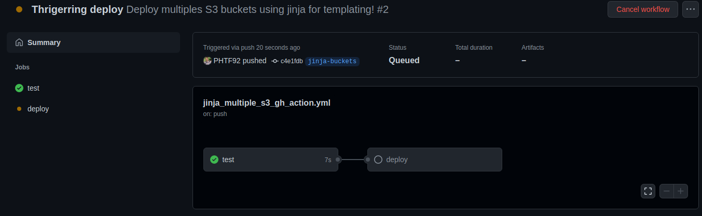
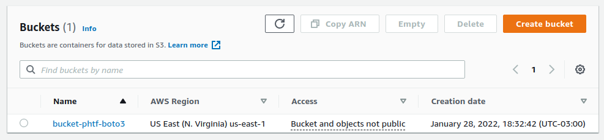
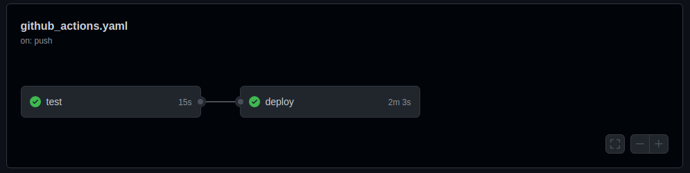
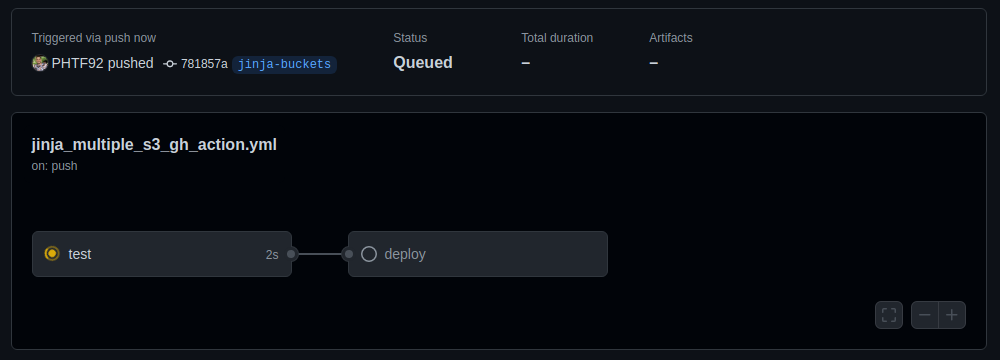
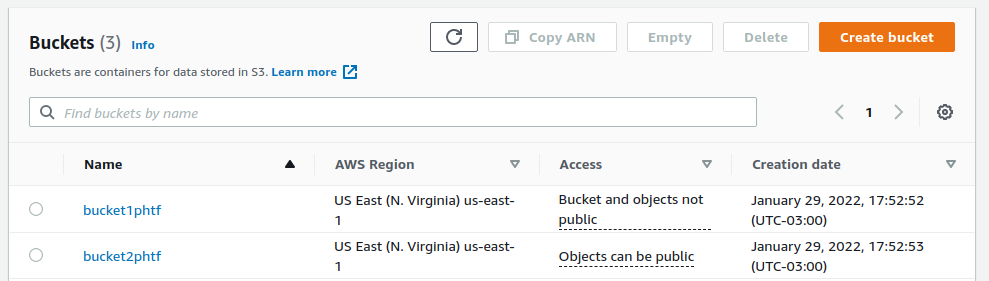
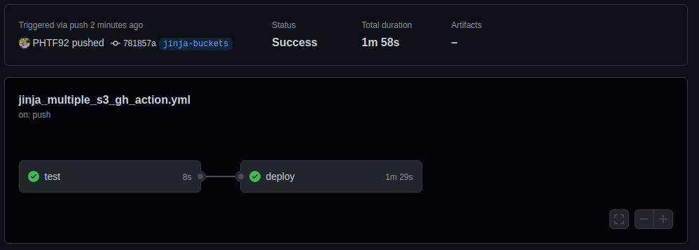
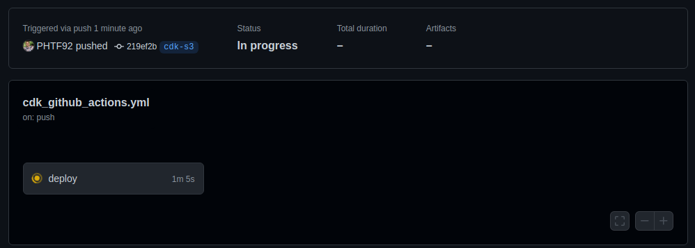
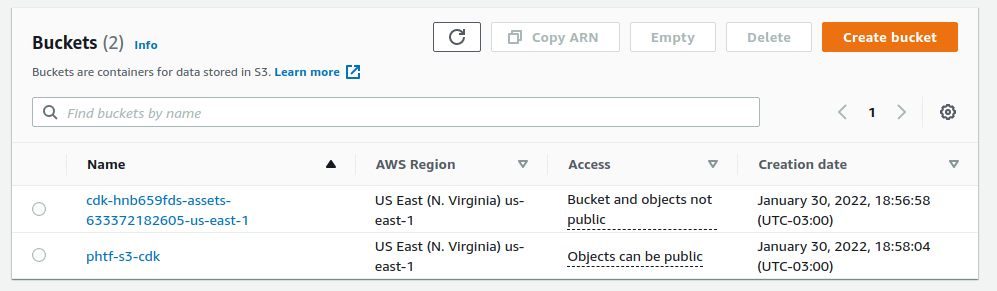
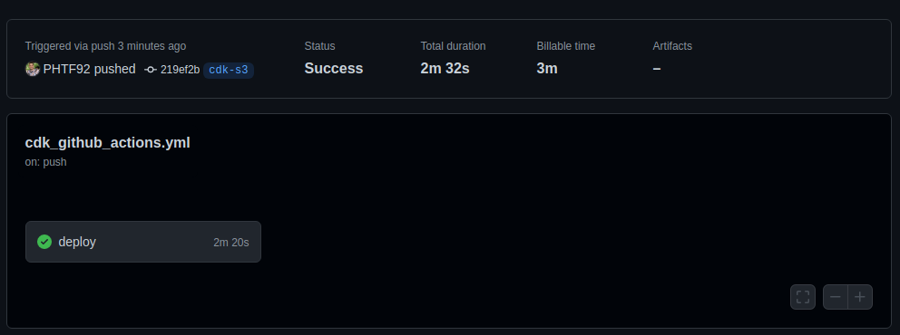
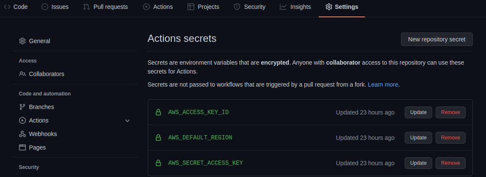

# CI-CD and Infrastructure as Code 

## Introduction and project overview

Continuous integration and continuous deployment are the foundation of any modern software development organization. It allows you to build, test, and deploy your software in a single step, following a predefined pipeline and the delivery is then quicker, more efficient and more reliable.

This project was created to automatically integrate and deploy an Infrastructure as Code in AWS.

Three cases were built, all of then consists in deploying one or more S3 buckets. It was used boto3, with a single template, boto3 with jinja for customizable templates and cdk.

## Tecnologies and tools used
* Language: Python
* AWS Services: S3, IAM
* IaC: boto3, cdk, jinja, yaml

##### Infrastructure:
* S3 buckets

##### Cases:
The project has four branches, main, cdk-s3, jinja-buckets and github_actions. The main branch contains the code and the others are branches that triggers the respective deployment when pushed.

Three deploys were created:

1 - Deployment using yaml template and boto3

The files to this deploy are at 'github_actions_deploy_s3' folder and the CI-CD pipilene is at '.github/workflows/github_actions.yaml'.
Pushing any commit to 'github_actions' branch will trigger the github action. First it will test the code (Figure 1.1), in this case it was used simply a dummy test just to see the pipeline running. Then it will call the deployment action, that runs 'deploy.py', a python file that reads the yaml tempĺate and creates a stack in AWS that deploys the bucket, as it can be seen in Figure 1.2. When it is done the pipeline is than ended with succesfull status (Figure 1.3).

Figure 1.1 - Beggining of the pipeline

Figure 1.2 - S3 Bucket created at AWS

Figure 1.3 - Pipeline ended successfully

2 - Deployment using jinja for templating and boto3
Jinja is a tamplating engine that can be used to add some logic into yaml files. It helps to create more customizable infrastructure as code, just changing a configuration file.

The files to this deploy are at 'jinja_deploy_multiple_s3_buckets' folder and the CI-CD pipilene is at '.github/workflows/jinja_multiple_s3_gh_action.yaml'.

Pushing any commit to 'jinja-buckets' branch will trigger the github action. First it will test the code (Figure 2.1), the same way as it was done in item 1. Then it will call the deployment action, that runs 'deploy.py', a python file that reads the yaml.js file and creates a template replacing the logic of that file into a new yaml file tha can be uploaded into AWS to create the stack and then deploy the bucket (Figure 2.2). The logic is based into a configuration file, that contains the buckets that must be created with the desired encription and the publicity of access. When it is done the pipeline is than ended with succesfull status (Figure 2.3).

Figure 2.1 - Beggining of the pipeline

Figure 2.2 - S3 Buckets created at AWS

Figure 2.3 - Pipeline ended successfully

3 - Deployment using AWS CDK

AWS CDK is aframework to deploy the infrastructure using python code. The advantages comes because it can use all the flexibilities that python language offers, as Object Orientation Paradigm, sugar syntax and repetition structures.

The files to this deploy are at 'cdk-project' folder and the CI-CD pipilene is at '.github/workflows/cdk_github_actions.yaml'.

Pushing any commit to 'cdk-s3' branch will trigger the github action. The only step is to  call the deployment action (Figure 3.1), that runs 'cdk deploy', a CLI cdk command to apply the deploy designed into the app file. It creates the stack and then deploys the bucket (Figure 3.2). When it is done the pipeline is than ended with succesfull status (Figure 3.3).

Figure 3.1 - Beggining of the pipeline

Figure 3.2 - S3 Bucket created at AWS

Figure 3.3 - Pipeline ended successfully

## How to run

Define the AWS credentials into the secrets of the project (settings -> secrets). The user of the credentials must have permission to deploy the infrastructure.

1. AWS_ACCESS_KEY_ID
2. AWS_DEFAULT_REGION
3. AWS_SECRET_ACCESS_KEY

To run the action simply push some commit into one of the three remote github actions branches (cdk-s3, jinja-buckets or github_actions) and follow the pipeline progress in "Actions" tab. When the pipeline ends succesfully you will see the buckets created in AWS.
